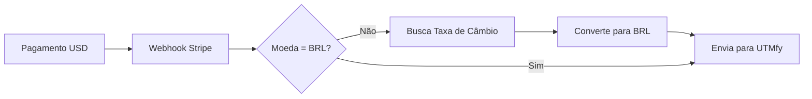

# Conversão de Moeda para UTMfy

## Problema

A UTMfy **sempre espera valores em BRL (Reais)**, mas o checkout pode processar pagamentos em diferentes moedas (USD, EUR, GBP, etc.).

Quando uma oferta está configurada em dólar (ou outra moeda), precisamos converter os valores para BRL antes de enviar para a UTMfy.

## Solução Implementada

### 1. Serviço de Conversão de Moeda

**Arquivo**: `src/services/currency-conversion.service.ts`

#### Funcionalidades

- ✅ **Cache de taxas de câmbio** (atualizado a cada 1 hora)
- ✅ **API externa de taxas** (exchangerate-api.com por padrão, grátis)
- ✅ **Fallback para valores padrão** se API falhar
- ✅ **Conversão automática** de qualquer moeda para BRL

#### Taxas de Câmbio Padrão (Fallback)

```javascript
USD: 5.0  // 1 USD = 5.0 BRL
EUR: 5.5  // 1 EUR = 5.5 BRL
GBP: 6.5  // 1 GBP = 6.5 BRL
BRL: 1.0  // 1 BRL = 1.0 BRL
```

#### Funções Principais

```typescript
// Converte valor de qualquer moeda para BRL
await convertToBRL(amountInCents: number, currency: string): Promise<number>

// Converte centavos para unidade principal (reais)
centsToUnits(amountInCents: number): number

// Inicializa serviço (busca taxas na primeira vez)
await initializeCurrencyService(): Promise<void>
```

### 2. Integração com UTMfy

**Arquivo**: `src/services/utmfy.service.ts`

#### Antes (❌)

```javascript
// Enviava valores na moeda original
Price: {
  Value: sale.totalAmountInCents / 100, // 100 USD
  Currency: "USD"  // ❌ UTMfy não aceita USD
}
```

#### Depois (✅)

```javascript
// Converte para BRL automaticamente
const totalAmountInBRL = await convertToBRL(sale.totalAmountInCents, currencyCode);

Price: {
  Value: centsToUnits(totalAmountInBRL), // 500 BRL (se taxa = 5.0)
  Currency: "BRL"  // ✅ Sempre BRL
}
```

### 3. Campos Convertidos

Todos os valores monetários enviados para UTMfy são convertidos:

- ✅ `OriginalPrice.Value` - Preço original em BRL
- ✅ `Price.Value` - Preço final em BRL
- ✅ `Commissions[].Value` - Comissões em BRL
- ✅ `currency` - Sempre "BRL"

## Configuração

### Variáveis de Ambiente (.env)

```bash
# API de Conversão (OPCIONAL)
# Se não configurado, usa API gratuita padrão
EXCHANGE_RATE_API_URL=https://api.exchangerate-api.com/v4/latest/BRL
EXCHANGE_RATE_API_KEY=sua_chave_aqui  # Opcional para APIs gratuitas

# UTMfy
UTMFY_API_URL=https://api.utmfy.com/conversions
UTMFY_API_KEY=sua_chave_utmfy
```

### APIs de Taxas de Câmbio Suportadas

#### 1. **ExchangeRate-API** (Recomendado - Grátis)
```
URL: https://api.exchangerate-api.com/v4/latest/BRL
Limite: 1500 requisições/mês (grátis)
Chave: Não necessária
```

#### 2. **ExchangeRate.host** (Grátis)
```
URL: https://api.exchangerate.host/latest?base=BRL
Limite: Ilimitado (grátis)
Chave: Não necessária
```

#### 3. **Fixer.io** (Pago)
```
URL: https://api.fixer.io/latest?base=BRL&access_key=SUA_CHAVE
Limite: 100 req/mês (plano gratuito)
Chave: Necessária
```

## Como Funciona

### Fluxo de Conversão



### Exemplo Prático

**Cenário**: Venda de $100 USD com taxa de R$ 5,00

```javascript
// 1. Payment Intent do Stripe
PaymentIntent {
  amount: 10000,        // 100 USD em centavos
  currency: "usd"
}

// 2. Conversão automática
const amountInBRL = await convertToBRL(10000, "USD");
// amountInBRL = 50000 (500 BRL em centavos)

// 3. Payload para UTMfy
{
  Price: {
    Value: 500.00,      // 500 reais
    Currency: "BRL"     // Sempre BRL
  }
}
```

### Logs de Conversão

O sistema loga todas as conversões para debugging:

```
💱 Conversão UTMfy: 100 USD = 500 BRL (taxa: 5.0)
📤 Enviando conversão para UTMfy: pi_xxxxx
✅ Conversão enviada para UTMfy com sucesso
```

## Atualização de Taxas

### Frequência

- **Cache**: 1 hora (3600 segundos)
- **Primeira vez**: Na inicialização do servidor
- **Automático**: Atualiza quando cache expira

### Monitoramento

```bash
# Verificar logs de inicialização
🔄 Inicializando serviço de conversão de moeda...
✅ Taxas de câmbio atualizadas: { USD: 5.2, EUR: 5.6, GBP: 6.7 }

# Logs de conversão em tempo real
💱 Conversão: 100 USD = 520 BRL (taxa: 5.2)
```

## Tratamento de Erros

### Se API de Taxas Falhar

```javascript
// Usa taxas em cache (última válida)
console.error("❌ Erro ao buscar taxas de câmbio, usando valores em cache");

// Se nunca conseguiu buscar, usa valores padrão
const defaultRates = {
  USD: 5.0,
  EUR: 5.5,
  GBP: 6.5
};
```

### Se Moeda Não Suportada

```javascript
// Usa taxa padrão genérica
console.warn("⚠️  Taxa não encontrada para XYZ, usando taxa padrão de 5.0");
return Math.round(amountInCents * 5.0);
```

## Testes

### Testar Conversão Manualmente

```javascript
// No código do webhook ou controller
const { convertToBRL, centsToUnits } = require('./services/currency-conversion.service');

// Exemplo: 100 USD
const brlAmount = await convertToBRL(10000, 'USD');
console.log('100 USD =', centsToUnits(brlAmount), 'BRL');
```

### Testar com Webhook do Stripe

1. Use Stripe CLI para enviar webhook teste
2. Configure moeda no Payment Intent
3. Verifique logs de conversão
4. Confira payload enviado para UTMfy

```bash
stripe trigger payment_intent.succeeded --override payment_intent.currency=usd
```

## Monitoramento em Produção

### Métricas Importantes

- ✅ Taxa de sucesso de busca de taxas de câmbio
- ✅ Frequência de uso do cache vs API
- ✅ Precisão das conversões
- ✅ Falhas de envio para UTMfy

### Alertas Recomendados

- ⚠️ API de taxas fora do ar por > 1 hora
- ⚠️ Uso de taxa padrão por moeda desconhecida
- ⚠️ Falha ao enviar para UTMfy

## Melhorias Futuras (Opcional)

- [ ] Suporte a mais moedas (JPY, CNY, etc.)
- [ ] Cache em Redis para múltiplas instâncias
- [ ] Retry automático se API de taxas falhar
- [ ] Dashboard de taxas de câmbio usadas
- [ ] Histórico de conversões para auditoria

---

**Resumo**: Todos os valores enviados para UTMfy são automaticamente convertidos para BRL, independente da moeda original do pagamento.
